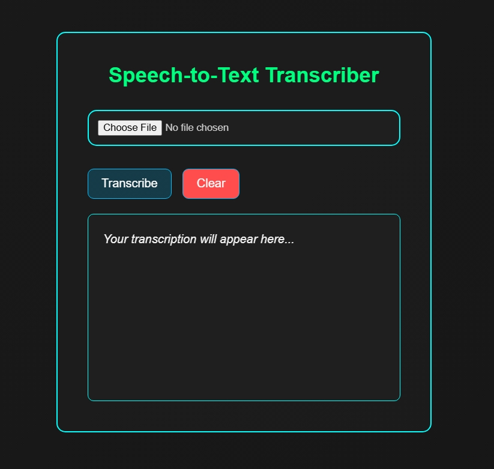

# 🗣️ Speech Recognition Tool

A browser-based speech recognition tool that converts `.mp3`/`.wav` audio files into text using advanced transcription models. Designed for AI and NLP tasks, it supports offline and online transcription.

---

**📸 Visuals**

---

**🚀 Features**
- 🎤 Upload audio files (`.mp3`, `.wav`) and get instant transcription  
- ⚙️ Works offline using OpenAI's Whisper models  
- 🧠 Smart UI updates: "Transcribing..." ➝ "Transcribed", with error handling & reset

---

**🛠️ Tech Stack**
| **Section**   | **Tools Used**                                   |
|---------------|--------------------------------------------------|
| **Frontend**  | HTML, CSS, JavaScript                            |
| **Backend**   | Python, Flask                                    |
| **Libraries** | Whisper, PyDub, Librosa, NumPy, Matplotlib       |
| **Hosting**   | Localhost (offline) / GitHub Pages / (Upcoming)  |

---

**📚 What I Learned**
- How to use OpenAI's Whisper for local transcription  
- Managing Flask routes for file handling and JSON responses  
- Designing UI behavior with only CSS and JavaScript  
- Handling model installation issues and deployment constraints  
- Working with `.wav` files, plotting audio waveforms, and audio features extraction

---

**🤝 Contributions**

This is a solo project built and maintained by me as part of my AI Internship & DEVIL Mode (FORCE FOCUS arc).  
More contributors are welcome in future versions with multi-language support.

---

**👤 Owner** - **Harshil Gurjar**

**📬 Contact**
- 📧 Gmail: [hdgurjar2323@gmail.com](mailto:hdgurjar2323@gmail.com)  
- 🔗 LinkedIn: [https://www.linkedin.com/in/harshil-gurjar23](https://www.linkedin.com/in/harshil-gurjar23)

---
